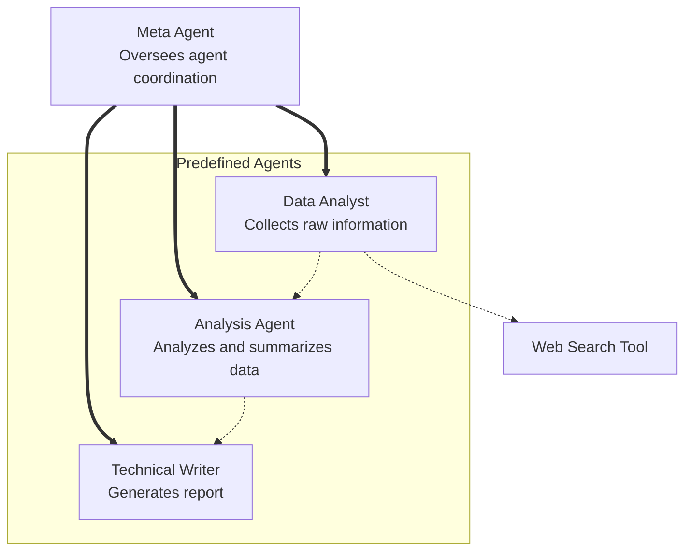
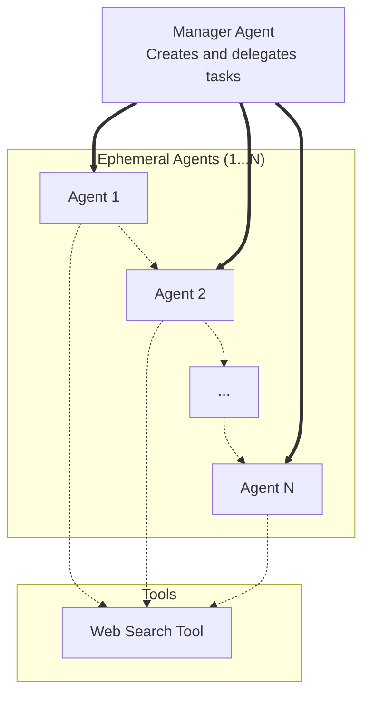

#  AI Agent Orchestrator

A modular framework for building an overseeing Agent that dynamically creates, coordinates, and executes specialized AI agents using **CrewAI**.

##  Project Overview

This project implements an ephemeral, ad-hoc multi-agent AI network using [CrewAI](https://docs.crewai.com/) to coordinate a group of specialized agents for solving high-level user tasks — such as researching stock market trends. Each agent plays a specific role in the pipeline, and tasks are executed in a logical sequence to produce a final written report.

This project demonstrates how to:
- Build an overseeing Agent capable of orchestrating sub-agents.
- Use **CrewAI** for agent collaboration and workflow management.
- Leverage **LangChain tools** for external tasks (e.g., web search). (Future)
- Create a scalable architecture for dynamic task delegation.

---


##  Tech Stack

- **Python 3.11**
- **CrewAI** (multi-agent orchestration)
- **Pydantic** (validation)
- **Custom Agent Modules** (`agents/` folder)
- **Crew Selection Modules** (`crews/` folder)
- **WebSearchTool** (for live data collection)

---


##  Glossary
| Concept |	Description |
|---------|-------------|
| Agent   |	An encapsulated unit of capability and intent (LLM + prompt + optional tools), responsible for performing a role. |
| Task    |	A unit of work associated with an agent. Each task includes a goal, optional tools, expected output, and context. |
| Crew    |	A container that holds agents and their assigned tasks, managing their execution as a pipeline or dynamic workflow. |
| Tools   |	Optional external functionality (e.g., web search, database access) that agents can invoke during task execution. |

---

##  Setup Instructions

### 1. Clone the repo
```bash
git clone https://github.com/agentic-human/ai-agent-orchestrator.git
cd ai-agent-orchestrator
```

### 2. Install dependencies
```bash
pip install -r requirements.txt
```

### 3. Add your API keys
Create a .env file with your credentials (e.g., for OpenAI and Google Search API):

```
OPENAI_API_KEY=your-key
GOOGLE_API_KEY=your-key
GOOGLE_CSE_ID=your-id
```

### 4. Run the app
```
python main.py
```

---


##  Static and Dynamic Architectures

### 1. Static Crew


####  Agents

- **Data Analyst (`data_agent`)**
  - Collects raw information via web search.
- **Analyst (`analysis_agent`)**
  - Analyzes and synthesizes collected data.
- **Technical Writer (`writer_agent`)**
  - Writes a coherent report from the analysis.

####  Meta Agent Orchestration

- A `meta_agent` oversees task delegation using an `assign_agents()` function.
- Tasks are defined with descriptive strings and mapped to the appropriate agents.

####  Execution Flow

1. User inputs a high-level task.
2. Agents and their tasks are assigned via the meta agent.
3. A `Crew` is created with the agents and tasks.
4. The `crew.kickoff()` method executes the workflow.
5. Final output is returned to the user.


---


### 2. Dynamically Generated Crew


####  Agents

Generated on-the-fly by the planning agent!

####  Manager-Planner Agent Orchestration

- A `manager_agent` dynamically generates a list of tasks to accomplish the user's goal.
- A factory loop iterates over the task list to create ephemeral, ad-hoc agents.
- The crew is assembled using the list of ad-hoc agents. 

####  Execution Flow

1. User inputs a high-level task.
2. Planning ("manager") agent determines incremental tasks to be performed.
3. Ephemeral agents are created on-the-fly from the task list.
4. A `Crew` is created with these dynamically assigned agents and tasks.
5. The `crew.kickoff()` method executes the workflow.
6. Final output is returned to the user.


---


##  How It Works

### 1. Agent Definitions:
* Data Analyst: Collects real-time data via `WebSearchTool`.
* Analysis Agent: Analyzes raw data to extract insights.
* Technical Writer: Synthesizes analysis into clear written content.

### 2. Task Assignments:
Tasks are mapped to agents via a custom `assign_agents()` function. Each task includes:
* A description
* An agent role
* Expected output format
* Tools (optional)

### 3. Crew Instantiation:
A Crew object is initialized with:
* The list of agents
* The list of tasks
* (Optional) execution configuration like `verbose=True`

### 4. Execution:
1. The crew is launched using `crew.kickoff()`.
2. Tasks are routed to appropriate agents.
3. Agent outputs are passed through the task pipeline.
4. Final result is returned to the user.

---

##  Project Structure
```
ai-agent-orchestrator/
├── agents/
│ ├── meta_agent.py      # Meta-agent and task planner 1
│ ├── manager_agent.py   # Meta-agent and task planner 2
│ ├── data_agent.py      # Info gatherer using LangChain tools
│ ├── analysis_agent.py  # Insight generator
│ ├── file_agent.py      # File-saving agent
│ └── writer_agent.py    # Content writer
├── tools/
│ ├── web_search_tool.py # LangChain web search tool
│ └── file_io_tool.py    # File I/O tool
├── main.py              # Entry point
├── requirements.txt     # Package imports
└── README.md
```

---


##  Example Use Case
Input: "Write a report on the state of solar energy in the US."

What happens:
1. The MetaAgent assigns roles to Data, Analysis, and Writer agents.
2. The DataAgent searches for recent info using Google Search.
3. The AnalysisAgent summarizes key insights.
4. The WriterAgent compiles it into a professional report.

---

##  Future Improvements
- [x] Add a Planner Agent to dynamically determine tasks.
- [x] Add a Manager Agent to dynamically assign agents.
- [ ] Integrate toolchains or API discovery for deeper analysis (e.g., stock API querying).
- [ ] Add feedback loops or memory for stateful agents.

---

##  Troubleshooting
### Python Version Error
If you see an error like:

```
ERROR: Package 'crewai-0.x.x' requires a different Python: 3.7.x not in '<3.13,>=3.10'
CrewAI requires Python 3.10–3.12.
```

Solution: Use pyenv to Install a Compatible Python Version
We recommend using pyenv to easily manage multiple Python versions.

Step-by-Step: Installing and Setting Up pyenv
1. Install pyenv
For macOS/Linux:
Use the automatic installer:

```bash
curl https://pyenv.run | bash
```
For Windows:
Use pyenv-win or install Python manually from https://www.python.org/downloads/release.

2. Configure Your Shell
After installation, add the following lines to your shell configuration file:

For bash (~/.bashrc or ~/.bash_profile):
```bash
export PYENV_ROOT="$HOME/.pyenv"
export PATH="$PYENV_ROOT/bin:$PATH"
eval "$(pyenv init --path)"
eval "$(pyenv init -)"
```

Then apply:

```bash
source ~/.bashrc
```

3. Install Python 3.11
```bash
pyenv install 3.11.8
pyenv local 3.11.8
```

Verify it worked:

```bash
python --version
```
Should show Python 3.11.8

4. Reinstall Dependencies
After switching to Python 3.11:

```bash
pip install --upgrade pip
pip install -r requirements.txt
```


