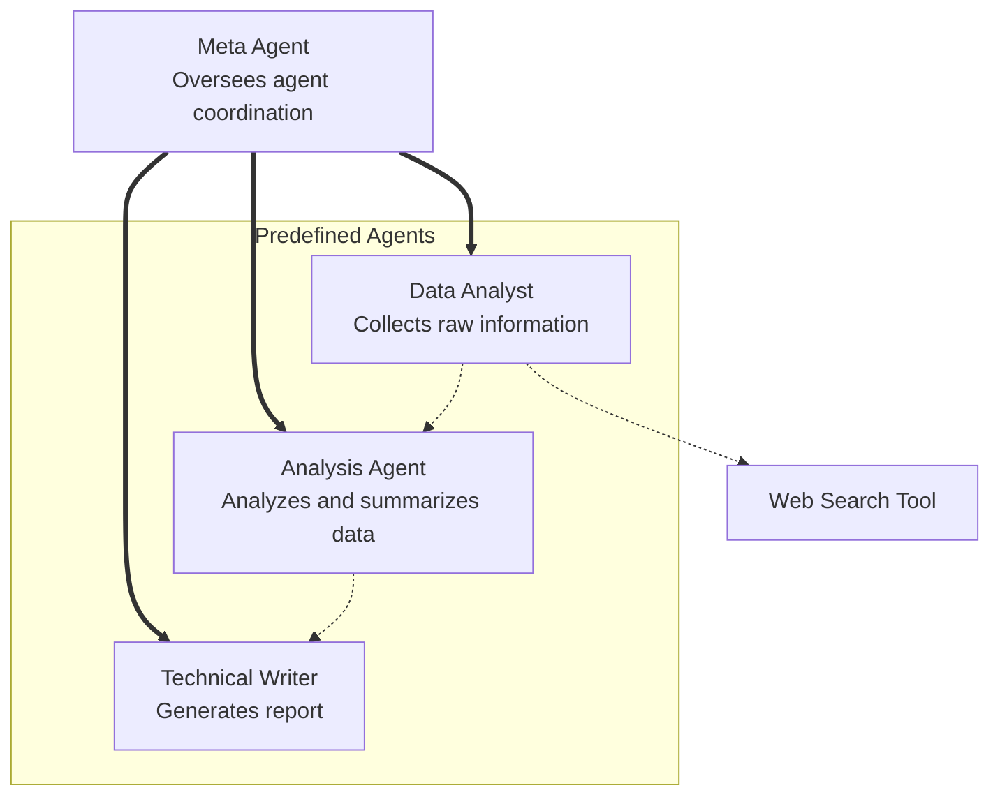
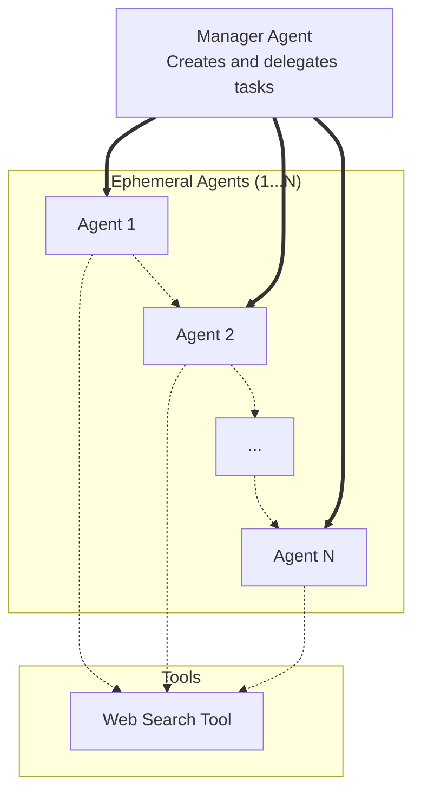

#  Ad-hoc Multi-Agent AI Orchestrator with CrewAI

##  Project Overview

This project implements an ephemeral, ad-hoc multi-agent AI network using [CrewAI](https://docs.crewai.com/) to coordinate a group of specialized agents for solving high-level user tasks — such as researching stock market trends. Each agent plays a specific role in the pipeline, and tasks are executed in a logical sequence to produce a final written report.

---

##  Static and Dynamic Architectures

### 1. Static Crew


####  Agents

- **Data Analyst (`data_agent`)**
  - Collects raw information via web search.
- **Analyst (`analysis_agent`)**
  - Analyzes and synthesizes collected data.
- **Technical Writer (`writer_agent`)**
  - Writes a coherent report from the analysis.

####  Meta Agent Orchestration

- A `meta_agent` oversees task delegation using an `assign_agents()` function.
- Tasks are defined with descriptive strings and mapped to the appropriate agents.

####  Execution Flow

1. User inputs a high-level task.
2. Agents and their tasks are assigned via the meta agent.
3. A `Crew` is created with the agents and tasks.
4. The `crew.kickoff()` method executes the workflow.
5. Final output is returned to the user.


---


### 2. Dynamically Generated Crew


####  Agents

Generated on-the-fly by the planning agent!

####  Manager-Planner Agent Orchestration

- A `manager_agent` dynamically generates a list of tasks to accomplish the user's goal.
- A factory loop iterates over the task list to create ephemeral, ad-hoc agents.
- The crew is assembled using the list of ad-hoc agents. 

####  Execution Flow

1. User inputs a high-level task.
2. Planning ("manager") agent determines incremental tasks to be performed.
3. Ephemeral agents are created on-the-fly from the task list.
4. A `Crew` is created with these dynamically assigned agents and tasks.
5. The `crew.kickoff()` method executes the workflow.
6. Final output is returned to the user.


---


##  Final Outcome

The orchestrator now:
- Accepts a task from the user.
- Coordinates agent roles via a static meta or dynamic manager agent.
- Executes a specialized research-analysis-writing pipeline.
- Returns a summarized output of stock market activity or any other topic.

```
User Input → Task 1 (Web Search) → ... → Task N (Report Writing) → Output
```

---

## Future Improvements
- [ x ] Add a Planner Agent to dynamically determine tasks.
- [ x ] Add a Manager Agent to dynamically assign agents.
- [ ] Integrate toolchains or API discovery for deeper analysis (e.g., stock API querying).
- [ ] Add feedback loops or memory for stateful agents.

---

##  Tech Stack

- **Python 3.11**
- **CrewAI** (multi-agent orchestration)
- **Pydantic** (validation)
- **Custom Agent Modules** (`agents/` folder)
- **Crew Selection Modules** (`crews/` folder)
- **WebSearchTool** (for live data collection - under development)

---

##  Errata

### Incompatible Package Versions (CrewAI & LangChain)
- **Issue**: CrewAI required a newer version of LangChain than what was initially installed, leading to errors when calling LangChain-based tools or integrations.
- **Symptoms**: Attribute errors or import issues when using LangChain wrappers inside CrewAI agents or tools.
- **Fix**: Aligned versions by upgrading both packages using:
  ```bash
  pip install --upgrade crewai langchain
  ```
and verified compatibility with the latest stable versions listed in both repos.

### `BaseTool` vs `Tool` Import Loop
- **Issue**: Confusion over whether to use `BaseTool` or `Tool` from `crewai.tools`. The documentation and examples had inconsistencies.
- **Loop**:
  - Initial attempt used `Tool`, which caused import or runtime errors.
  - Switched to `BaseTool`, which was not directly usable or lacked required interfaces.
  - Backtracked to `Tool`, but required correct class structure and dependencies like `args_schema`.
- **Fix**: Used the correct tool instantiation from CrewAI examples (`WebSearchTool`), avoiding manual `Tool` subclassing altogether.

###  Type Handling
- **Issue**: Passed `verbose=2` (invalid type).
- **Fix**: Corrected to `verbose=True`.

###  Attribute Errors
- **Issue**: Attempted to access nonexistent attributes like `agent.alias`.
- **Fix**: Removed or updated print statements to reference valid agent properties.

###  Crew Initialization
- **Issue**: Incorrect or missing parameters during `Crew()` instantiation.
- **Fix**: Ensured all required fields were included and valid.

###  API Mismatch
- **Issue**: Called `crew.run()` which is outdated.
- **Fix**: Replaced with `crew.kickoff()` (current CrewAI API method).

---
